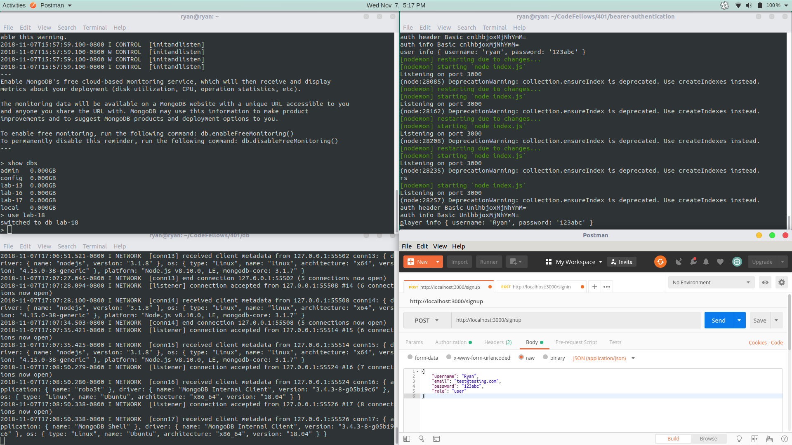

# Bearer Authentication
Making use of another person's code and integrating it into mine whilst tweaking the code to working with my current base

## Dependencies
* "babel-env": "^2.4.1",
* "babel-eslint": "^10.0.1",
* "babel-register": "^6.26.0",
* "bcrypt": "^3.0.2",
* "cors": "^2.8.5",
* "dotenv": "^6.1.0",
* "express": "^4.16.4",
* "jsonwebtoken": "^8.3.0",
* "mongoose": "^5.3.9"

## Dev Dependencies
* "babel-core": "^6.26.3",
* "babel-jest": "^23.6.0",
* "eslint": "^5.8.0",
* "jest": "^23.6.0",
* "mongodb-memory-server": "^2.7.0",
* "supertest": "^3.3.0"

## Code
I made use of another person's code (the auth folder) and integrated it into mine whilst tweaking the code to working with my current base.
I changed the incoming model to a Player Schema.

## Proof of Life
* POST /signup route with the body

* POST /signup route with the response

* POST /signin route with credentials

* POST /signin route with response
